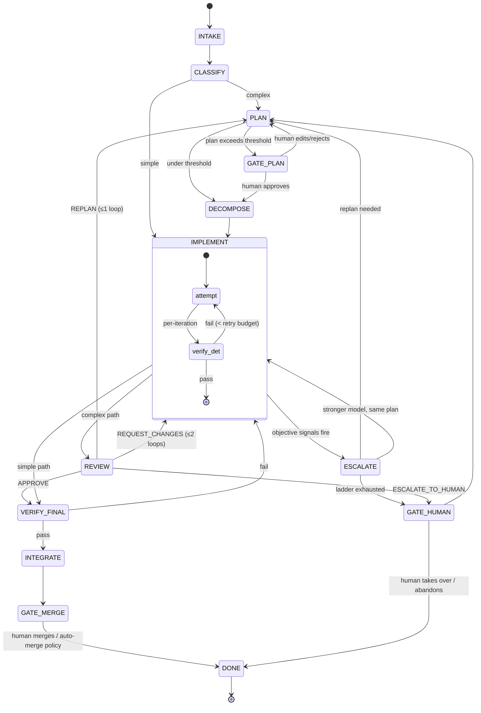

# Multi-Provider Agent Delegation System — Technical Design

**Status:** Draft v1 · **Date:** 2026-08-09 · **Scope:** Design only, no implementation

This document designs a reusable multi-agent task-delegation workflow for software
development, with particular attention to game-development projects. The two governing
principles, in priority order:

1. **Spend expensive reasoning only where it materially improves decisions; use cheap
   models where the work is predictable.**
2. **Separate the workflow/protocol from the model/provider, so providers can be
   swapped without redesigning the system.**

---

## 0. Decision register (the big calls, up front)

Every major architectural decision in this document, so reviewers can disagree with
the decision rather than hunt for it:

| # | Decision | Alternative rejected | Why |
|---|----------|---------------------|-----|
| D1 | The **orchestrator is deterministic code**, not an LLM | LLM-as-orchestrator | State machines, budgets, retries, and permissions must be auditable, cheap, and never hallucinate. LLM judgment is injected at specific points (classify, plan, review), not for control flow. |
| D2 | The **protocol is files + JSON schemas**, in a state directory **outside the repo** | Shared message bus; or `.task/` committed in the repo | Files are durable, inspectable, provider-neutral, and survive crashes — any model that can read/write files can participate. Keeping them out of the working tree (§4.0) is what makes worktree parallelism possible: artifacts shared by every worktree cannot conflict at merge, and git history stays free of run scaffolding. |
| D3 | The **router is config-driven deterministic scoring**, not an LLM | LLM-based routing | Routing runs on every stage transition; it must be fast, free, reproducible, and debuggable. The only LLM in the routing path is the task *classifier*, and it's a cheap model with a heuristic pre-filter. |
| D4 | **Escalation triggers on objective signals**; self-reported confidence is a tiebreaker only | "Ask the model if it's confident" | Models are poorly calibrated about their own work. Test failures, scope overruns, and edit churn are measurable. |
| D5 | **Deterministic verification (build/test/lint) runs before any LLM review** | Review-first | Never pay reviewer tokens to discover a compile error. Cheapest check always runs first. |
| D6 | **Parallelism is granted by declared file scopes**, executed in git worktrees, with a per-project "hotspot" list that forces serialization | Optimistic parallelism + merge-time resolution | Merge-time conflict resolution is where multi-agent systems die, especially with game-engine binary/scene files that cannot be merged at all. |
| D7 | **Tests for complex tasks are authored from requirements, independently of the implementation** | Implementer writes own tests only | An implementer's tests confirm what it built, not what was asked. Independent authorship catches requirement gaps. (Implementers still practice TDD locally.) |
| D8 | **Humans gate irreversible or expensive decisions asynchronously**; everything reversible inside a worktree is automated | Approve-every-step or full autonomy | Worktrees make almost everything reversible, which is what makes high autonomy safe. |
| D9 | The MVP **reuses existing agent CLIs** (Claude Code, Codex CLI, Gemini CLI) as the agent runtime rather than building a tool-execution harness | Custom agent loop over raw APIs | Tool execution, sandboxing, and file editing are the hard 80% of an agent runtime, and they already exist. The orchestrator shells out; the protocol stays in files. |
| D10 | Execution is reached through a **runtime adapter interface** (§4.6); [herdr](https://herdr.dev) is the reference adapter, local subprocess the fallback | Coupling the orchestrator directly to one runtime | Session hosting, worktrees, and provider auth are all runtime concerns that differ per environment (herdr is beta on Windows, absent in CI). An adapter keeps the orchestrator and the skill portable, and lets a good runtime supply credential handling for free without becoming a hard dependency. |
| D11 | **Companion skills are called, not absorbed** — karpathy-guidelines and superpowers for role-local disciplines, code-winnow's scanner as a deterministic check | Reimplementing their content in role cards, or vendoring their files | A role card is a context budget, not a library. Each ships its own progressive disclosure; copying it in bills every role that never needs it. Availability is detected once by the orchestrator and declared in `task.json`, so a missing companion degrades loudly instead of silently. |
| D12 | **This protocol is out-of-session; [superpowers](https://github.com/obra/superpowers) is in-session** — that is the whole distinction | Building on superpowers' subagent dispatch | superpowers decomposes work *inside* one agent's session: it dispatches subagents with crafted prompts and writes plans to `docs/superpowers/plans/` in the repo. That is the better answer when one session owns the work. It cannot survive a process boundary, a provider swap, or a crash, because the handoff is a prompt rather than an artifact — and its plans land in the working tree, which §4.0 forbids. This design pays for files and schemas to buy exactly those properties. Where the two overlap and superpowers is better, call it (D11). |

---

## 1. High-level architecture

### 1.0 The layer boundary

Four layers, and the rule is that **each one only knows about the layer directly
below it**:

```text
User
 └─ Orchestrator      deterministic: state machine, scheduling, routing, enforcement
     └─ Skill         the protocol: roles, artifacts, handoffs, escalation vocabulary
         └─ Agents    reasoning and coding execution (Planner/Implementer/Tester/Reviewer)
             └─ Runtime adapter    herdr · local subprocess · anything else
                 └─ Isolated git worktrees
```

What each layer must **not** do is the load-bearing part:

| Layer | Owns | Must never |
|---|---|---|
| Orchestrator | State transitions, budgets, model routing, gates, git authority | Delegate enforcement to an agent's good behavior |
| Skill | Protocol, role instructions, artifact conventions | **Name a model or provider, or perform routing**; reference a specific runtime |
| Agents | Reasoning, code, evidence | Choose their own model, exceed their scope, invent state transitions |
| Runtime adapter | Spawning, worktrees, prompting, liveness, notifications | Interpret artifacts or make workflow decisions |

The skill describes escalation as "the orchestrator will move this to a stronger
model" so agents know what happens to their report — but it never selects one.
Routing lives in `registry.default.yaml` and the router (§5), which is
orchestrator-side and never shipped into an agent's context.

```text
┌────────────────────────────────────────────────────────────────────┐
│                          ORCHESTRATOR (code)                       │
│   task state machine · budgets · retries · escalation engine       │
│   permission broker · secrets · telemetry                          │
└───┬──────────────┬─────────────────┬─────────────────┬─────────────┘
    │              │                 │                 │
    ▼              ▼                 ▼                 ▼
┌─────────┐  ┌───────────┐  ┌──────────────┐  ┌───────────────┐
│ ROUTER  │  │ WORKSPACE │  │  HITL GATE   │  │ VERIFY RUNNER │
│ config- │  │  MANAGER  │  │ async human  │  │ build · test  │
│ driven  │  │ worktrees │  │  approvals   │  │ lint · engine │
│ scoring │  │ lock table│  └──────────────┘  │  headless     │
└────┬────┘  └─────┬─────┘                    └───────────────┘
     │             │
     ▼             ▼
┌────────────────────────────────────────────────────────────────────┐
│                     AGENTS (LLM sessions, sandboxed)               │
│  Classifier · Planner · Test Author · Implementer · Reviewer ·     │
│  Integrator — each loads the agent-delegation SKILL +              │
│  a role card + task context injected by the orchestrator           │
└───────────────────────────┬────────────────────────────────────────┘
                            │ read/write
                            ▼
┌────────────────────────────────────────────────────────────────────┐
│      ARTIFACT STORE — XDG state dir, OUTSIDE the repo (§4)         │
│  task.json (state) · task.md (intent) · plan.md (approach)         │
│  decisions.md · deviations.md · reports/*.json                     │
└────────────────────────────────────────────────────────────────────┘
```

Component responsibilities:

- **Orchestrator** — the only component with global authority. Drives the state
  machine, spawns agents, enforces budgets (tokens, wall-clock, iterations), owns
  secrets and git push rights, collects escalation signals, and calls the HITL gate.
  Plain code. Restartable from `task.json` at any time.
- **Router** — pure function `(role, task_metadata, provider_health) → model + fallback chain`,
  driven by a capability registry config file. No side effects, fully loggable.
- **Workspace manager** — creates/destroys git worktrees, maintains the file-scope
  lock table, computes conflict/parallelism decisions, orders integration.
- **Verify runner** — deterministic checks: compile, unit tests, lint, formatting,
  engine headless import/build. No LLM. Its output is the ground truth all agents
  and reviewers argue from.
- **Agents** — short-lived, role-scoped LLM sessions. Stateless between stages;
  all state they need lives in the artifact store. Any provider that can run an
  agentic file-editing session qualifies.
- **HITL gate** — an async approval queue (CLI prompt, Slack message, PR review —
  transport-pluggable). Never blocks work that doesn't need it.

The key structural property: **agents talk to each other only through artifacts**,
never directly. That is what makes them swappable across providers.

---

## 2. Task lifecycle / state machine

### 2.0 Who decides the state machine?

"The orchestrator is deterministic code" (D1) needs an important clarification —
*deterministic* does not mean the path through the lifecycle is fixed. The split is:

- **The graph is fixed in code** — the set of states, the legal transitions between
  them, and the guard conditions (budgets, loop caps, gate requirements) are
  authored by the system designer and versioned with the orchestrator. No agent
  can invent a state or a transition.
- **Which edge is taken is decided by structured inputs**, most of which come from
  LLMs and the verify runner: the Classifier's tier picks simple-vs-complex; the
  Planner's subtask graph determines how many IMPLEMENT instances run and in what
  order; the Reviewer's verdict enum selects among four predeclared edges; agent
  signals and verify results fire the escalation edges; the human resolves gate
  states.

So LLMs steer, but only by choosing among options the graph already offers, and
always through schema-validated outputs (a verdict enum, a signal object, a subtask
list) — never by emitting free-text instructions the orchestrator has to interpret.
This is what keeps the system both adaptive and auditable: every run's path is
replayable from `task.json`'s stage history as "input X arrived, guard Y held,
edge Z taken." When the lifecycle itself needs to change — a new stage, a new
escalation rung — that is a code change to the orchestrator, deliberately: the
control flow is the safety boundary, and it should evolve at code-review speed,
not at inference time.

### 2.0b Amendments to the proposed lifecycle

The user's proposed lifecycle (`request → classify → plan → implement → test →
review → integrate`) is close, with four amendments:

1. **Split "test" into two different things.** *Deterministic verification*
   (compile/run existing tests) is not an agent stage — it's a runner invoked after
   every implementation iteration. *Test authorship* is an agent stage, and for
   complex tasks it runs **from the requirements, in parallel with implementation**,
   not after it (D7).
2. **Add an explicit `DECOMPOSE` step** between planning and implementation, because
   decomposition is where parallelism and file scopes are declared.
3. **Classification is tiered**, not a single LLM call: heuristics first, cheap LLM
   only when ambiguous, and *default to COMPLEX when uncertain* (the cost of
   over-planning a simple task is small; the cost of under-planning a complex one
   is a failed run).
4. **Integration is mostly orchestrator work** (merge, verify, present), with an
   Integrator *agent* invoked only when merges conflict or subtask implementations
   disagree.

### 2.1 State machine



### 2.2 Stage table — mandatory vs optional, model tier

| Stage | Mandatory? | Model tier | Notes |
|-------|-----------|-----------|-------|
| INTAKE | Always | none | Normalize request into `task.md`; capture acceptance criteria. Orchestrator + template. |
| CLASSIFY | Always | none → cheap | Heuristics (keywords, estimated file count from a repo map, request length, "refactor/migrate/redesign" flags). Cheap LLM only if heuristics are ambiguous. |
| PLAN | Complex only | **strong reasoning** | The single highest-leverage expensive call in the system. A good plan lets cheap implementers succeed. |
| DECOMPOSE | Complex only | strong (same session as PLAN) | Declares subtasks, file scopes, dependencies, parallel groups. |
| TEST AUTHOR | Complex only, skippable when tests exist | cheap–medium | Writes/extends tests from `task.md` + `plan.md`, deliberately blind to implementation diffs. |
| IMPLEMENT | Always | cheap–medium coding model | One agent per subtask. TDD locally; verify runner after each iteration. |
| VERIFY (deterministic) | Always, every iteration | none | Build, tests, lint, engine headless checks. Free-ish and non-negotiable. code-winnow's scanner joins these when installed (§4.7) — stdlib, sub-second, no model call. |
| REVIEW | Complex: always. Simple: lightweight tier | **strong reasoning** | Compares requirements → plan → diff → test evidence. See §8. |
| INTEGRATE | Always | none; Integrator agent only on conflict | Topological merge of worktrees, verify after each merge. |

### 2.3 When to split into subtasks

Split when *any* of: planner estimates > ~400 changed lines or > ~8 files; the work
spans independently testable seams (systems, layers, features); parts have different
capability needs (e.g., shader work vs. UI wiring); or parts can run in parallel
under disjoint file scopes. **Do not** split when subtasks would share a tightly
coupled file scope — a split that forces serialization plus handoff overhead is
worse than one agent doing it sequentially. Prefer **vertical slices** (a feature
end-to-end) over horizontal layers when systems are coupled (see §10).

### 2.4 When to stop and ask the human

Enumerated in §9. Summary: irreversible actions, plan-level ambiguity the planner
flags with a concrete question, budget exhaustion, second REPLAN, and
reviewer/planner disagreement.

### 2.5 Retry and escalation summary

Every failure walks the same ladder (detailed in §6): retry same model with failure
context → stronger model, same role → replan → human. Each rung has a budget;
budgets are in `task.json`, enforced by the orchestrator, never by the agent.

---

## 3. The agent-delegation skill

### 3.1 Concept

A single reusable skill document (`SKILL.md` + role cards) that any agent loads at
session start. It teaches the **protocol**, not the task: *you are one role in a
pipeline; your inputs are these artifacts; your outputs are these artifacts; here
is when you must stop and escalate rather than push through.*

The most important behavioral rule the skill must instill — because it is the
opposite of default LLM behavior — is:

> **You are not the whole system.** Do not expand scope, do not fix unrelated
> problems, do not silently deviate from the plan, and do not push through blockers
> that the protocol says to escalate. An honest `BLOCKED` report is a success state,
> not a failure.

### 3.2 Static (in the skill) vs dynamic (injected by orchestrator)

| In the skill (static, versioned) | Injected per-invocation (dynamic) |
|---|---|
| Role definitions and their boundaries | **Which role you are right now** |
| Artifact directory layout and schemas | Task ID and absolute artifact paths |
| The handoff report format (§3.4) | File-scope allowlist for this subtask |
| Escalation signal vocabulary and how to raise one | Iteration/token budgets and current counts |
| Deviation-recording protocol | Prior-stage reports relevant to this stage |
| Communication norms (write for the next agent, cite plan line numbers) | Project-specific facts: build commands, hotspot list, engine version, conventions |
| Constraint categories (never push, never leave worktree, never touch secrets) | Task-specific constraints from the plan |

Rationale for the split: everything static must be true for **every task in every
project**, so agents can be trained/tested against a stable protocol. Everything
that varies is data, and data belongs in the injection, not the skill — otherwise
you fork the skill per project and lose reusability.

### 3.3 Role cards

Each role card is one page: mission, inputs, required outputs, hard boundaries,
escalation triggers specific to the role.

- **Planner/Architect** — Mission: produce a plan a *weaker model can execute
  without you*. Inputs: `task.md`, repo exploration. Outputs: `plan.md` (with
  machine-readable subtask blocks), `decisions.md` entries, open questions.
  Boundary: writes no production code. Must flag ambiguities as concrete questions
  with a default answer (so the human can approve-by-silence).
- **Test Author** — Mission: encode the requirements as executable tests. Inputs:
  `task.md`, `plan.md`, existing test suite. **Explicitly not given** implementation
  diffs. Outputs: test files inside its declared scope, `reports/test-author.json`.
  Boundary: tests must fail before implementation exists (red state is evidence).
- **Implementer** — Mission: make the plan true for one subtask. Inputs: `plan.md`
  subtask block, `task.md`, test suite. Outputs: code within file scope, deviation
  entries, `reports/impl-<subtask>.json`. Boundary: file-scope allowlist; deviations
  beyond a threshold require raising a signal, not just logging.
- **Reviewer** — Mission: verify requirements → plan → diff → evidence chain (§8).
  Outputs: structured verdict. Boundary: every finding must cite a requirement ID or
  plan line; findings without a citation are advisory-only and cannot block.
- **Integrator** — Invoked only on merge conflicts or cross-subtask incompatibility.
  Mission: reconcile with minimal change, preferring the implementation closer to
  plan; records the reconciliation in `decisions.md`.

The **Classifier** is deliberately not a full role card — it's a one-shot prompt
owned by the orchestrator, because it runs before any workspace exists.

### 3.3b Packaging as an installable skill repo

The skill ships in the same shape as [cheatsheet-creator-skill](https://github.com/wyc79/cheatsheet-creator-skill):
a repo whose root holds `README.md` + `LICENSE`, with the skill itself in a
`<skill-name>/` folder containing `SKILL.md`, installable via
`npx skills add git@github.com:<owner>/agent-delegation-skill.git` or by dropping
the folder into an agent's skills directory:

```text
agent-delegation-skill/
├── README.md                     # what it is, install, folder conventions
├── LICENSE
├── DESIGN.md                     # this document
├── registry.default.yaml         # shipped model scores + tier bands (§5.3c) — orchestrator-side, not skill-side
└── agent-delegation/
    ├── SKILL.md                  # ≤100 lines: orientation + routing to everything else
    ├── roles/                    # one card per role, ~100 lines; load exactly one
    │   ├── planner.md
    │   ├── implementer.md
    │   ├── test-author.md
    │   ├── reviewer.md
    │   └── integrator.md
    ├── references/               # load only when the situation arises
    │   ├── escalation.md         # full signal catalog + how to raise one
    │   ├── deviations.md         # severity rules, worked examples
    │   ├── parallelism.md        # file scopes, worktree etiquette
    │   ├── task-dir.md           # locating $TASK_DIR (Linux/macOS/Windows)
    │   ├── scratch-files.md      # the in-repo escape hatch (§4.5)
    │   └── engines/              # godot.md, unity.md, unreal.md — game projects only
    ├── schemas/
    │   ├── report.schema.json    # §3.4 handoff contract
    │   ├── subtask.schema.json   # plan.md YAML blocks
    │   └── verdict.schema.json   # §8.3 reviewer output
    └── templates/
        ├── task.md
        ├── plan.md
        └── deviations.md
```

Conventions carried over from the reference repo:

- **`SKILL.md` frontmatter** = `name` + a long, trigger-rich `description` that
  tells a host agent *when* to load the skill ("you have been assigned a role in
  a delegated development workflow", "you are the planner/implementer/reviewer for
  task …", "`$AGENT_DELEGATION_TASK_DIR` is set in the environment").
- **Numbered, imperative workflow steps** inside each role card (the reference
  skill's Step 0…N style), each ending with the artifact the step must write —
  so "produce the report" is a step, not an afterthought.
- **Templates over prose**: artifact formats are given as fenced templates to copy,
  not described abstractly, mirroring the reference skill's summary template.

The orchestrator's dynamic injection (§3.2) arrives as the prompt that *invokes*
the skill — role assignment, paths, scopes, budgets — never by editing skill files.

### 3.3c Progressive disclosure and context budget

Context spent on protocol is context not spent on the code, and this protocol is
large enough (roles, artifacts, schemas, escalation, parallelism, engine quirks)
that loading it all would tax every agent for material 90% of them never use — the
implementer doesn't need review criteria, the reviewer doesn't need worktree
etiquette, a web project needs nothing from `engines/`. So disclosure is layered,
with **budgets treated as design constraints, not aspirations**:

| Layer | Budget | Loaded when | Contents |
|---|---|---|---|
| Frontmatter `description` | ~4 lines | always resident | Trigger phrases only |
| `SKILL.md` | **≤100 lines** | skill invoked | Orientation and routing (below) |
| One `roles/<role>.md` | ~100 lines | always, exactly one | Numbered steps + that role's outputs |
| `references/<topic>.md` | ~150 lines each | on the named trigger | Depth for a situation that arose |
| `schemas/*.json` | as needed | when writing that artifact | Exact field validation |
| `references/engines/*.md` | ~150 lines | game repos only | Engine-specific rules from §10 |

**What stays in `SKILL.md`** — only what *every* role needs before it knows
anything else: how to identify your assigned role and find your card; the
how to locate `$TASK_DIR` and its map in a short table; the hard rules that must never
be missed (stay in your file scope, never push, log deviations, an honest
`BLOCKED` beats a fabricated success, write the report before exiting); a
one-line-per-item index of what's in `references/` **with its trigger**; and the
handoff report shape by pointer, not by full schema.

**What moves out** — role procedures, the full escalation-signal catalog,
deviation severity rules, parallelism/worktree etiquette, engine specifics,
JSON schemas, artifact templates. Each becomes a file the agent reads only when
its trigger fires.

**Triggers are stated as conditions, not invitations.** The index reads
`Blocked, or a test failed 3× → read references/escalation.md`, not "see also."
Vague pointers get ignored under load; conditional ones fire reliably — and this
is the mechanism that keeps `SKILL.md` short without losing the material.

**Two rules that keep it honest over time:** every fact lives in exactly one file
(duplication across the skill and a role card is how the two drift into
contradicting each other), and *the orchestrator never pastes skill content into
prompts* — it injects paths and task data (§3.2), so growth in the protocol costs
disk, not per-agent context.

### 3.4 The handoff contract

Every agent ends its session by writing `reports/<stage>-<agent>.json`:

```json
{
  "stage": "implement",
  "subtask": "st-2-combat-hooks",
  "status": "complete | blocked | escalate",
  "summary": "one paragraph for the next agent, not for the human",
  "artifacts_written": ["src/combat/hooks.gd", "$TASK_DIR/deviations.md"],
  "deviations": ["dev-3"],
  "signals": [{"type": "scope_overrun", "detail": "...", "evidence": "..."}],
  "evidence": {"tests": "42 passed, 0 failed", "verify_run_id": "v-129"},
  "open_questions": []
}
```

The orchestrator validates this against a schema; an agent that exits without a
valid report is treated as crashed (§12). The `summary` field is written *for the
downstream agent* — the skill explicitly instructs: no pleasantries, no restating
the task, only what changed, what surprised you, and what the next role must know.

---

## 4. Planning artifacts

### 4.0 Where artifacts live: outside the repository

Orchestration state **never enters the working repository** — not as a committed
directory, not as an ignored one. The reasons compound:

- Worktrees make in-repo state actively wrong. A `.task/` on the integration
  branch is invisible to subtask worktrees cut before it changed, and any
  attempt to share it makes every agent's checkpoint commit a write to a file
  every *other* agent is also writing. Report files would collide at every merge.
- It pollutes history and diffs with churn that is not the deliverable, and
  leaks planning scratch into any PR.
- `.gitignore` does not fix it: ignored files still sit in the worktree, get
  wiped by `git clean`, and are absent from a fresh worktree that needs them.

**Investigated first: does herdr already have a place for this?** Findings from
herdr 0.8.0 on this machine:

- There is **no `~/.herdr/`**. herdr follows XDG: `~/.config/herdr/`
  (`config.toml`, `session.json`, sockets, logs) and `~/.local/state/herdr/`
  (runtime state — currently `agent-detection/`).
- herdr has **no per-project document or artifact store** to reuse. Its
  project-adjacent primitives are *terminal topology* (workspaces, tabs, panes),
  *git worktree-backed workspaces*, and `workspace report-metadata`, which is
  explicitly **display-only**, token/TTL-based, and meant for surfacing status in
  the UI — not durable storage.
- `~/.local/state/herdr/` is herdr's **private runtime state**, not a documented
  extension point. Writing our artifacts there would couple us to another tool's
  internals and risk being clobbered on upgrade.

So the correct reading of "reuse herdr rather than reinvent" is: **reuse a
runtime's mechanisms, not its storage.** We adopt the XDG convention as a
sibling directory of our own, and delegate execution concerns — worktree
lifecycle, env injection, agent lifecycle, notifications — through the runtime
adapter (§4.6), where herdr is the reference implementation rather than a
requirement.

### 4.1 Layout

```text
$XDG_STATE_HOME/agent-delegation/            # default: ~/.local/state/agent-delegation
├── index.json                               # project-key → repo path, for humans and tooling
└── projects/
    └── <project-key>/                       # e.g. my-game-3f9a1c2b
        ├── project.json                     # repo identity, engine, hotspots, verify commands
        └── tasks/
            └── T-014/
                ├── task.json                # machine state    (AUTHORITATIVE: status)
                ├── task.md                  # intent + criteria (AUTHORITATIVE: what)
                ├── plan.md                  # approach + subtasks (AUTHORITATIVE: how)
                ├── decisions.md             # append-only ADR-lite log
                ├── deviations.md            # append-only departures from plan.md
                ├── brief.md                 # human-facing rendering (§9.4)
                ├── reports/                 # per-stage JSON handoffs (§3.4)
                └── verify/                  # verify-runner outputs, by run id
```

**Project key — the mechanism that makes this work across worktrees.** Every
worktree of a repo resolves to the *same* git common directory:

```bash
git rev-parse --path-format=absolute --git-common-dir
# main checkout  → /repos/my-game/.git
# any worktree   → /repos/my-game/.git      (identical — verified)
```

So the key is `<repo-basename>-<first 8 hex of sha256(realpath(common-dir))>`.
Any agent, in any worktree, in any provider's CLI, derives the same project key
from one git command with no configuration. The basename keeps the directory
human-navigable; the hash keeps two same-named repos apart.

**How an agent finds its task directory**, in order:

1. `$AGENT_DELEGATION_TASK_DIR` — an absolute path injected by the orchestrator
   when it creates the workspace (herdr's `workspace create --env KEY=VALUE`).
   This is the normal path and requires no lookup.
2. Derive the project key as above, then read
   `projects/<key>/tasks/` and select by the task id in the prompt.
3. If neither resolves, **stop and ask** — do not create a task directory and do
   not fall back to writing inside the repo.

**What stays in the repository:** source, tests, and durable documentation —
including design docs, ADRs, and any artifact whose value outlives the task.
Orchestration state (status, budgets, reports, verify logs, briefs) is
scaffolding and stays out. The boundary test: *would this still be worth reading
a year from now with the task long finished?* If yes, an agent may propose
committing it as project documentation; the run's bookkeeping never is.

Changes from the originally proposed in-repo layout, with reasons:

- **`requirements.md` is merged into `task.md`.** Requirements separated from the
  task statement drift; a single intent document with numbered acceptance criteria
  (`AC-1`, `AC-2`, …) is what the Reviewer and Test Author both key off.
- **`affected_files.md` is dissolved into two owners.** *Planned* scope lives in
  `plan.md` subtask blocks (where the workspace manager reads it for lock
  decisions); *actual* touched files live in `task.json`'s per-subtask record,
  computed from git rather than self-reported. A standalone hand-maintained file
  list has no owner and goes stale — this way the planned/actual divergence is
  exactly what the reviewer's mechanical scope check compares.
- **`task.json` is added** as the one purely machine-owned file. Agents never write
  it. It carries status, stage history, budgets/counters, model assignments,
  delegation history, and worktree refs — everything needed to resume after a crash.
- **`deviations.md` is added** and is load-bearing (see 4.4).
- **`test_plan.md` is dropped** as a separate file; the test plan is a section of
  `plan.md` (same author, same lifecycle) and results live in `verify/`.

### 4.2 File contents

**`task.json`** (orchestrator-owned; agents read, never write). Covers task
identity, implementation status, agent/model assignment, and delegation history
in one resumable document:

```json
{
  "id": "T-014",
  "mode": "attended",
  "status": "implementing",
  "project_key": "my-game-3f9a1c2b",
  "repo": {"path": "/repos/my-game", "common_dir": "/repos/my-game/.git",
           "base_commit": "a1b2c3d", "integration_ref": "refs/adg/T-014/integration"},
  "classification": {"tier": "complex", "by": "heuristic+llm", "score": 0.81},
  "limits": {
    "max_cost_usd": 15.00,
    "max_attempts_per_subtask": 8,
    "max_review_loops": 2,
    "max_replans": 1,
    "max_parallel_agents": 3,
    "escalation_ceiling": "t2",
    "human_approval_required": ["plan", "merge", "dependency_change", "destructive_op"]
  },
  "spent": {"usd": 4.10, "attempts": {"st-2": 3}, "review_loops": 1, "replans": 0},
  "subtasks": [
    {"id": "st-2-combat-hooks", "status": "complete",
     "worktree": "/repos/.worktrees/T-014-st-2", "branch": "adg/T-014/st-2",
     "planned_scope": ["src/combat/combat_system.gd"],
     "actual_files": ["src/combat/combat_system.gd", "src/combat/hooks.gd"],
     "iterations": 3, "report": "reports/implement-st-2-combat-hooks.json"}
  ],
  "delegation_history": [
    {"at": "2026-08-09T10:02:11Z", "stage": "plan", "role": "planner",
     "model": "opus-class-strong", "channel": "claude-seat",
     "herdr": {"workspace": "w3", "pane": "w3:p1", "agent": "planner-t014"},
     "outcome": "complete", "usd": 1.80},
    {"at": "2026-08-09T10:31:04Z", "stage": "implement", "role": "implementer",
     "subtask": "st-2-combat-hooks", "model": "balanced-coder",
     "channel": "cursor-seat", "outcome": "escalate",
     "signals": ["test_stuck"], "rung": 0, "usd": 0.42}
  ],
  "gates": [{"kind": "plan_approval", "state": "approved",
             "by": "human", "at": "2026-08-09T10:20:00Z"}]
}
```

`delegation_history` is append-only and is what makes §5.6 telemetry possible
(which model, in which role, escalated how often, at what cost) as well as
answering "how did this code come to exist" months later.

**Limits are enforced by the orchestrator and fail closed.** `limits` is the
complete set of hard stops; `spent` is the running count. The invariant:

> Every limit is checked **before** the action that would consume it, never
> after. A missing, unparseable, or out-of-range limit does not mean "unlimited"
> — it parks the task in `NEEDS_HUMAN`.

| Limit | Checked before | On breach |
|---|---|---|
| `max_cost_usd` | Every agent invocation, using the *projected* cost | Park; human raises the cap or abandons |
| `max_attempts_per_subtask` | Each implementation iteration | Escalate one rung (§6.2); park if the ladder is exhausted |
| `max_review_loops` | Sending findings back to an implementer | Force `REPLAN` |
| `max_replans` | Re-entering PLAN | Park — repeated replanning means the task is ill-posed |
| `max_parallel_agents` | Spawning a subtask agent | Queue it; never exceed, even when scopes are disjoint |
| `escalation_ceiling` | Router selection (§5.3b) | Skip rung 2, fall through to replan/human |
| `human_approval_required` | Entering the named stage | Block (attended) or park and notify (autonomous) |

Three properties make this enforceable rather than advisory: agents never read
or write `limits` (so they cannot negotiate with them), every counter is
incremented by the orchestrator from observed events rather than self-reports,
and limits **compose downward only** — a task may lower a deployment default,
never raise it (§5.3b). Raising any limit is a human act, recorded in `gates`.

**`task.md`** — human-readable; the original request verbatim, then a normalized
restatement, then numbered acceptance criteria, then explicit non-goals. Non-goals
matter: they are the Reviewer's weapon against scope creep.

**`plan.md`** — prose approach and risks for humans, plus fenced machine-readable
subtask blocks:

````markdown
## Subtasks
```yaml
- id: st-1-combat-model
  goal: Extract damage calculation into DamageResolver
  file_scope: ["src/combat/damage*", "src/combat/resolver/**"]
  reads: ["src/entities/**"]
  depends_on: []
  parallel_group: A
  capability_hint: {coding: high, reasoning: medium}
  estimated_loc: 250
  acceptance: [AC-1, AC-3]
- id: st-2-combat-hooks
  goal: Wire resolver into CombatSystem
  file_scope: ["src/combat/combat_system.gd"]
  depends_on: [st-1-combat-model]
  parallel_group: B
  hotspots: ["src/combat/combat_system.gd"]
  acceptance: [AC-2]
```
````

This embedded-YAML pattern is the answer to "machine-readable but human-inspectable":
one file, one owner (the Planner), both audiences.

**`decisions.md`** — append-only, ADR-lite: `D-3 | planner | Chose composition over
inheritance for resolver because … | supersedes: —`. Any agent may append; only
appends allowed.

**`deviations.md`** — append-only: `dev-3 | impl:st-2 | plan.md:L48 said extend
BaseSystem; it is sealed in engine 4.3 | did instead: composition wrapper |
severity: minor`. Format: *plan reference, reality found, action taken, severity*.

### 4.3 Authority ordering

When artifacts disagree, precedence is:

```text
task.md (intent)  >  plan.md + deviations.md (approach as actually amended)  >  code
```

Downstream rules: the Reviewer reads `plan.md` **through** `deviations.md` (a
deviation is an amendment, not a violation — unless unlogged); the Test Author
reads only `task.md` + `plan.md`; Implementers treat `plan.md` as binding and
`decisions.md` as context.

### 4.4 Deviation protocol

Silent divergence between plan and code is the failure mode that makes review
meaningless. The rule: **any departure from `plan.md` must be either logged
(minor) or signaled (major)**. Severity is defined objectively: a deviation is
*major* if it touches files outside the declared scope, changes a public
interface named in the plan, or contradicts an entry in `decisions.md` — major
deviations fire an escalation signal (§6) instead of just a log line. The Reviewer
cross-checks the diff against declared scopes mechanically (the orchestrator gives
it the file-list diff), so unlogged deviations are detectable, not just discouraged.

### 4.4b Cross-platform: Windows

Windows is not an afterthought here — it is where most Unity and Unreal work
happens, so the game-development goal (§10) implies first-class Windows support.
Nine concrete divergences, each with the decision taken:

**1. State root.** There is no XDG on Windows. Resolution order is
`%XDG_STATE_HOME%` if set (Git Bash and WSL users often do), else
`%LOCALAPPDATA%`, else `$HOME/.local/state` on Linux/macOS. `%LOCALAPPDATA%` and
not `%APPDATA%`: this is machine-local scratch and must not roam.

**2. Project-key canonicalization.** `git rev-parse --path-format=absolute
--git-common-dir` already returns forward slashes on Windows. Before hashing:
strip a trailing slash, and **lowercase the path on Windows only** — the
filesystem is case-insensitive, so `C:/Repo/.git` and `c:/repo/.git` are one
directory and must not yield two keys. The key is machine-local, so it never
needs to match across platforms; it only needs to be stable *within* a machine.

**3. `MAX_PATH` (260 chars).** Unreal and Unity paths are deep, and worktrees add
a prefix. Mitigations, in order: place worktree roots at a short path
(`C:\adg\<task-id>\<subtask>`, never nested inside a deep repo), set
`core.longpaths=true` for the task's repo, and prefer the Win10+ long-path
policy where the environment allows it. The orchestrator **checks the projected
worktree path length at DECOMPOSE** and shortens subtask ids rather than
discovering the failure mid-implementation.

**4. Case-insensitive filesystem.** Two subtasks scoped to `src/Foo.cs` and
`src/foo.cs` are the same file. **All file-scope, hotspot, and lock comparisons
casefold on Windows and macOS** — a case-sensitive comparison silently grants
parallel write access to one file. This applies to macOS too, which is
case-insensitive by default and is easy to forget.

**5. Line endings.** `core.autocrlf` can make a diff look like a whole-file
rewrite. The mechanical scope check is unaffected because it compares
**file lists** (`git diff --name-only`), not content — but *line-count* signals
(`estimated_loc` overrun, `edit_churn`) can inflate badly. So line-based
thresholds are computed with `--ignore-cr-at-eol`, and **agents must never change
`core.autocrlf` or bulk-normalize line endings**; that is a major deviation.

**6. Filename charset.** Windows forbids `: * ? " < > |` in filenames and
reserves `CON`, `PRN`, `AUX`, `NUL`, `COM1`…, `LPT1`…. Every identifier that
becomes a path component is therefore restricted to `[a-z0-9-]` (already enforced
by the id patterns in `schemas/`). One live trap: **herdr pane and tab ids
contain colons** (`w1:p1`) — they are values inside `task.json`, and must never
be interpolated into a filename.

**7. File locking.** Windows refuses to delete files held open, and Unity,
Unreal, and antivirus scanners all hold handles. `git worktree remove` and
`git clean` will therefore fail intermittently. Cleanup **retries with backoff,
then defers**: a worktree that will not delete is recorded in `task.json` and
pruned at the next task start (`git worktree prune`), never force-deleted while a
process may still be writing.

**8. Symlinks** need Developer Mode or elevation. The design uses none, and must
keep it that way — no symlinking the task directory into the repo, which would
also violate §4.0.

**9. Shells and tooling.** An agent may be in PowerShell, cmd, Git Bash, or WSL.
This is why every build, test, and lint command comes from **project config**
rather than being assumed POSIX (§2.2), and why the permission broker's denylist
needs a PowerShell-aware equivalent (`Remove-Item -Recurse -Force`,
`Invoke-WebRequest | iex`) rather than only matching `rm -rf` and `curl | sh`.

**herdr caveat:** herdr ships stable binaries for Linux and macOS; **native
Windows support is preview-only beta** (per its install docs). So on Windows the
**local adapter** (§4.6) is not a rarely-exercised branch — it may be the primary
path, which is a good reason to keep it a real implementation rather than a
documented intention. WSL2 is the pragmatic alternative, at the cost of slow cross-OS
filesystem access when the repo lives on the Windows side (keep it inside the
WSL filesystem if you go that route).

Agent-facing version of the path rules: `references/task-dir.md`.

### 4.7 Companion skills

Three optional tools, each attached at the one place it belongs. All degrade to
"not installed", reported rather than omitted (D11).

| Companion | Attaches at | Called by | Why there |
|---|---|---|---|
| [code-winnow](https://github.com/wyc79/code-winnow-skill) `scripts/scan.py` | Verify | **Orchestrator**, as a subprocess | Stdlib, ~0.2s, no model call — a deterministic check in the sense of D5, not an exception to it. Its five-judge review pipeline is a different and far costlier thing, and is not called. |
| `andrej-karpathy-skills:karpathy-guidelines` | Before writing code | Implementer, Integrator | Its "surgical changes" section is the `file_scope` rule from the other direction; "simplicity first" is what the reviewer measures the diff against. |
| `superpowers:systematic-debugging` | Second failed attempt | Implementer | By the third attempt the ladder is already escalating. It does not buy a fourth. |

Two rules hold for all of them. **Findings are advisory**: authority is
`task.md`, the plan, and the deterministic checks, in that order — a style
judgement that could block a merge would reintroduce the taste loop the reviewer
rules exist to prevent. And **they are referenced, never vendored**: a stale copy
that reports nothing looks exactly like a clean result.

Availability is detected once by the orchestrator and written to `task.json`, so
agents never hunt the filesystem. The agent-facing version is
`agent-delegation/references/companions.md`.

### 4.5 The in-repo escape hatch

Some tools cannot be talked out of writing into the working tree: engine test
runners that emit reports beside the project, build tools that accept only
relative output paths, profilers, coverage writers. A rule with no exception
here would just be violated quietly, so the exception is defined and checkable.

**The rule:** if a file must land inside the repo, it must go where the repo
**already ignores**, verified mechanically rather than by convention:

```bash
git check-ignore -v <path>     # exit 0 + the matching rule = safe; exit 1 = stop
```

**Agents may not create the condition that satisfies the rule.** Editing
`.gitignore` is a change to the project and lands in the diff — it is precisely
the pollution being avoided. When no suitable ignored location exists, the agent
raises `blocked_command` and stops.

**The orchestrator, not the agent, may provision one.** At task setup it can
append a task-scoped entry to `.git/info/exclude` — repo-local, never committed,
invisible to diffs and PRs, and (living in the git common dir) automatically
shared by every worktree of the task. That is the one place a new ignore rule may
come from, and it is cleaned up at task teardown.

Three supporting constraints keep this from becoming a side channel:

1. **Ephemeral by definition.** Ignored paths are wiped by `git clean -xdf`, are
   absent from fresh worktrees, and may be cleared by the owning tool. Anything
   cited as evidence must be copied into `$TASK_DIR` (verify output into
   `verify/`), because the next agent may run in a different worktree.
2. **`git status --porcelain` must be clean of it** before an agent exits — the
   same mechanical check the reviewer already runs for scope. A scratch file that
   appears there was never actually ignored.
3. **Durable documentation is not scratch.** A design doc or ADR that outlives
   the task belongs in the repo's normal docs path, committed and reviewed like
   any other change — never hidden in an ignored directory to dodge review. The
   inverse also holds: run bookkeeping never gets committed as "documentation."

Agent-facing version of this: `references/scratch-files.md`.

### 4.6 The runtime adapter

The orchestrator never calls a runtime directly. It calls a small adapter
interface, and a runtime implements it. herdr is the reference implementation;
plain local subprocesses are the always-available fallback. **Neither the skill
nor the state machine mentions any runtime** — the skill contains zero references
to herdr, and that is a property to preserve.

The whole interface is seven operations:

| Operation | Contract | herdr adapter | local adapter |
|---|---|---|---|
| `create_worktree(branch, base, path)` | Isolated checkout exists | `herdr worktree create` | `git worktree add` |
| `remove_worktree(path)` | Best-effort; may defer (§4.4b) | `herdr worktree remove` | `git worktree remove`, then `prune` |
| `start_agent(role, channel, cwd, env)` | A live agent session, task dir in `env` | `workspace create --env` + `agent start --kind` | `spawn <cli> --cwd` with env |
| `prompt(session, text) -> settled` | Returns when the agent settles | `agent prompt --wait` | write stdin, wait for exit |
| `status(session)` | `working` / `idle` / `blocked` / `gone` | agent lifecycle states | process alive + exit code |
| `notify(kind, brief)` | Human sees a gate request | `notification show`, `workspace report-metadata` | terminal prompt / stdout |
| `teardown(session)` | Session released | `pane`/`workspace close` | kill process |

Everything else stays orchestrator-side: artifacts, state machine, budgets,
routing, and gates. Two contract notes that apply to **every** adapter:

- **`status()` answers "is it alive?", never "did it succeed?"** An agent can go
  `idle` having accomplished nothing. Success is a schema-valid report plus
  verify output — never a lifecycle state.
- **Runtime-side display is not state.** herdr's `workspace report-metadata` is
  display-only with a TTL and is a fine place to show `T-014 · implementing ·
  2/4`, and a terrible place to keep anything; `task.json` remains the only
  source of truth. Any adapter's status surface is treated the same way.

What a *good* adapter contributes beyond the minimum is convenience, not
capability: herdr supplies authenticated CLI sessions (so the orchestrator holds
no provider credentials, §11.2), pane persistence across detach, and free
liveness signals. The local adapter supplies none of that — the orchestrator then
holds credentials itself and polls processes — and the workflow is identical
either way. That is the test of whether the boundary is real.

Adapter choice is configuration, not code: `runtime: herdr | local` per channel
in `registry.default.yaml`. On Windows, where herdr is preview-only beta
(§4.4b), the local adapter may be the primary path — which is precisely why it
must stay a real implementation rather than a documented intention.

---

## 5. Model/provider routing

### 5.1 Layering

```text
Roles (workflow) → Capability profiles (routing config) → Model registry → Access channels (per-deployment)
```

The workflow names roles. Roles map to capability *requirement profiles*. The
registry maps concrete models to capability *scores*. **Channels** (§5.4) describe
*how* a model is reachable — a metered API key, or a flat-rate subscription seat
with quotas — and what it marginally costs through that path. Only the registry
and channels mention provider names; swap providers by editing one file.

### 5.2 Capability dimensions

Keep the vocabulary small — every dimension must be something you can actually
observe or benchmark:

`reasoning`, `coding`, `instruction_adherence` (does it stay inside file scopes and
follow the protocol?), `context_capacity` (tokens), `tool_reliability` (agentic
edit/run loops without derailing), `speed` (tokens/sec class), `cost` ($/Mtok in+out).
Scored 1–5 except capacity/cost which are numeric.

**Registry** (illustrative — values are deployment-owned config, not design):

```yaml
models:
  strong-reasoner-1:  {provider: p1, reasoning: 5, coding: 4, adherence: 4, tool: 4, speed: 2, cost_in: 15, cost_out: 75, ctx: 200k}
  balanced-coder-1:   {provider: p2, reasoning: 3, coding: 5, adherence: 4, tool: 5, speed: 4, cost_in: 3,  cost_out: 15, ctx: 200k}
  fast-cheap-1:       {provider: p3, reasoning: 2, coding: 3, adherence: 3, tool: 3, speed: 5, cost_in: 0.3, cost_out: 1.5, ctx: 1m}

profiles:
  planner:     {require: {reasoning: 5, ctx: ">=150k"}, weights: {reasoning: 3, adherence: 1}, cost_sensitivity: low}
  implementer: {require: {coding: ">=4", tool: ">=4"},  weights: {coding: 3, adherence: 2, speed: 1}, cost_sensitivity: high}
  test_author: {require: {coding: ">=3"},               weights: {adherence: 3, coding: 2}, cost_sensitivity: high}
  reviewer:    {require: {reasoning: ">=4", coding: ">=4"}, weights: {reasoning: 3, coding: 2}, cost_sensitivity: medium}
  classifier:  {require: {}, weights: {speed: 2}, cost_sensitivity: max}
```

### 5.3 Selection algorithm (deterministic)

1. **Hard filter** on `require` + provider health (circuit breaker open? context
   fits the estimated prompt?).
2. **Score** survivors: `Σ weights·capability − λ(cost_sensitivity)·log(cost)`.
   (The hard filter in step 1 also drops anything not enrolled for this role or
   above the active escalation ceiling — see §5.3b.)
3. **Pick top; the sorted remainder is the fallback chain** — no separate fallback
   config to maintain.
4. Per-invocation overrides: a subtask's `capability_hint` from the plan can raise
   requirements (the Planner knows a subtask is hard; the router doesn't).
   Escalation (§6) also enters here: rung 2 re-runs selection with
   `reasoning := reasoning+1` required and cost sensitivity lowered.

Rule-based vs score-based vs LLM-based: this is **score-based with rule-based hard
filters**, per D3. An LLM router adds latency, cost, and non-reproducibility to a
decision that has maybe five inputs. The place where LLM judgment legitimately
affects routing is upstream — task classification and the planner's per-subtask
capability hints — which is exactly where this design puts it.

### 5.3b Escalation ceilings — capping the top tier without hardcoding

An escalation ladder with no upper bound drifts upward by construction: every
rung asks for "stronger," and the strongest tier is usually the one with the
worst cost/benefit for *coding* work (large marginal spend, slower, often no
better at the actual edit). A deployment must be able to say "the top of my
ladder is the Opus-class tier; the ultra tier is not in play" — **without writing
a model name into the workflow**, and without a denylist that needs editing every
time a provider ships something new.

Three declarative mechanisms, none of which name a model in workflow code:

**1. Enrollment is opt-in and fail-closed.** Registry entries are only selectable
if explicitly enrolled, and enrollment is per-role:

```yaml
models:
  strong-reasoner-1: {tier: t2, enrolled_roles: [planner, reviewer, implementer], ...}
  ultra-reasoner-1:  {tier: t3, enrolled_roles: []}     # present, scored, unused
```

There is no rule anywhere saying "don't use the ultra model" — it simply was
never enrolled, so the router cannot see it. A newly released top-tier model is
invisible until a human scores and enrolls it, which is the correct default for
something that spends money.

**2. The ceiling is a policy in the routing vocabulary,** not a name:

```yaml
policy:
  escalation_ceiling:
    max_tier: t2                     # bands, not brands
    max_marginal_cost_per_call: 2.50 # hard $ stop, whatever the model
    max_reasoning: 5                 # "don't reach past what the task needs"
  overrides:
    reviewer: {max_tier: t2}         # per-role ceilings allowed
```

Tier bands (`t1` cheap/fast, `t2` strong, `t3` ultra) are *capability bands
assigned in the registry*, so mapping a new model into a band is a one-line
registry edit and the ceiling policy never changes. Banding is a maintained
judgment about cost/capability position — flagship "strong" models land in `t2`;
the heaviest reasoning tiers above them land in `t3` — which means the registry
needs review whenever a provider ships a new tier. That review is the one
recurring config chore this design accepts, and it's deliberately the chore that
happens *outside* a running task rather than inside an escalation. Because cost here is the
§5.4 *marginal* cost, a top-tier model reachable free through a subscription seat
is judged on its quota draw rather than its list price — the ceiling constrains
real spend, not sticker price.

**Enrollment and ceiling are independent gates, and a model must pass both.**
Enrolling an ultra-tier model for the planner does *not* make it reachable while
the ceiling sits at `t2`; raising the ceiling does *not* make an unenrolled model
visible. Turning on the top tier is therefore a deliberate two-line change, which
is the intended friction — one accidental edit can't put the most expensive model
in the escalation path.

**3. Ceilings compose down, never up.** Deployment config sets the default;
a repo config or a single task (`task.json.policy.escalation_ceiling`) may
*lower* it, never raise it. A cheap experiment can cap itself at `t1`.

**Consequence for the ladder (§6.2):** rung 2 re-routes with higher required
reasoning **clamped to the ceiling**. When nothing enrolled sits above the current
model within the ceiling, rung 2 is *skipped, not stalled* — the ladder falls
through to rung 3 (replan) and then rung 4 (human). This is deliberate: once
you're at the top of your declared tier, the useful move is a better plan or a
human, not a bigger bill. A ceiling-only deployment therefore degrades gracefully
rather than deadlocking.

**Escape hatch stays human.** Exceeding the ceiling is not a move the ladder can
make. At rung 4 the human may grant a one-off override (recorded in `task.json`
and `decisions.md` with its cost), which fits the existing gate on high-cost model
invocation (§9.3). The expensive tier remains reachable — by explicit human act,
never by automatic drift.

### 5.3c First run: who configures models, and how much?

Two things are often conflated here, and separating them is the point of
principle #2:

- **Installing the skill requires no model configuration at all.** Agents never
  pick models — they receive a role and artifacts. You can drop
  `agent-delegation/` into any agent's skills folder and it works, because the
  skill contains no provider knowledge (§3.2).
- **The orchestrator's router needs to know what you have.** That's one config
  file, and it should be *generated by detection and confirmed once*, not typed.

**Shipped defaults do the scoring.** The repo ships a maintained
`registry.default.yaml`: known models with capability scores and tier bands
already assigned. Capability scores are reference data (a property of the model,
same for everyone), so users should never hand-author them — they inherit the file
and it updates with the project. What is genuinely deployment-specific is only:
*which channels exist, which models are enrolled, and what the ceiling is.*

**`delegate init` detects and proposes.** On first run it asks herdr which agent
CLI sessions are authenticated, maps each to a channel, and writes a proposed
config, then shows it as a plain-language brief (§9.4) for one confirmation:

```text
Found 2 signed-in agent CLIs:
  • Claude Code   (subscription seat) — can run: strong-reasoner, balanced-coder
  • Cursor        (subscription seat) — can run: balanced-coder, fast-cheap

Proposed setup
  Planning & review   → strong-reasoner via Claude Code
  Implementation      → balanced-coder via Cursor   (Claude Code as backup)
  Tests & sorting     → fast-cheap via Cursor
  Ceiling             → t2 (strong). Ultra-tier models found but NOT enabled.
  Reserve             → keep 30% of the Claude window free for planning/review

[Enter] accept   [e] edit   [s] single-seat mode
```

Accepting writes `router.yaml`; nothing else is required to start. Three defaults
make that safe:

1. **Only detected channels are enrolled** — enrollment is fail-closed (§5.3b), so
   anything not found is simply absent rather than a lurking fallback.
2. **Ultra tier (`t3`) is never auto-enrolled**, even when detected and even when
   free through a seat. Opting in is a deliberate edit — exactly the behavior asked
   for by "don't escalate to the heaviest model."
3. **Unknown models are ignored, not guessed.** A CLI exposing a model absent from
   the registry is reported ("found X, unscored — not used") rather than assigned
   improvised scores.

**Degenerate cases stay usable.** With one seat, `init` proposes single-seat mode:
same role structure, same model everywhere, and role differentiation carried by
prompts and reasoning-effort settings instead of by model choice — the workflow is
unchanged, which is the whole point of separating protocol from provider. With
zero detected CLIs, the system refuses to run rather than falling back to
something expensive.

**Re-running is cheap.** `delegate init --recheck` re-detects after a new CLI
login or a registry update and shows a diff of what would change; it never
silently re-enrolls. Ongoing tuning is thus editing one short file, and the
telemetry from §5.6 is what tells you whether the proposed split was right.

### 5.4 Plan capacity and access channels

Real deployments rarely pay list-price API rates for everything. A typical solo
setup is *"Claude Max subscription + Cursor Pro"*: two flat-rate seats, each
exposing different model tiers, each with its own quota shape. Routing on
`cost_in`/`cost_out` alone gets this exactly backwards — through a subscription
with headroom, the strongest model's **marginal cost is ≈ 0**, while the same
model via a metered API key is the most expensive call in the system.

So the unit the router selects is not a model but a **(model, channel)** pair:

```yaml
channels:
  claude-max:
    type: subscription            # flat-rate seat
    runtime: claude-cli           # doubles as the agent runtime (D9)
    exposes: [strong-reasoner-1, balanced-coder-1]
    quota: {window: 5h, est_capacity: 40u, weekly_cap: true}
  cursor-pro:
    type: subscription
    runtime: cursor-cli
    exposes: [balanced-coder-1, fast-cheap-1]
    quota: {window: monthly, est_capacity: 500req}
  api-key-p1:
    type: metered                 # true $/Mtok, no quota — the overflow valve
    runtime: claude-cli
    exposes: [strong-reasoner-1, fast-cheap-1]
```

Selection changes in three ways:

1. **Marginal cost replaces list cost.** The §5.3 cost term becomes the channel's
   *effective* cost: `0` for a subscription with headroom, list price for metered.
   With a Max seat at low utilization, the router will correctly send even
   implementation work to a strong model — free capability is capability.
2. **Quota pressure is a shadow price.** Subscriptions aren't free, they're
   *prepaid and capped*, so effective cost rises with utilization of the quota
   window: `effective_cost = list_cost × f(utilization)` where `f` is ~0 when the
   window is empty and approaches (or exceeds) list price as it fills. This makes
   the router naturally shift low-stakes work (implementer iterations, test
   authoring, classification) to the Cursor-tier channel as the Claude window
   fills, while **reserving headroom for the calls only the strong seat can make**
   — planner, reviewer, rung-2+ escalations. That reservation is also explicit:
   profiles may pin `preferred_channel`, and a config floor ("keep ≥30% of the
   strong window free for planner/reviewer/escalation") backstops the shadow price.
3. **Quota exhaustion is a routing event, not a failure.** The orchestrator meters
   every call per channel (it proxies or spawns them all, so this is free). A
   channel whose window is exhausted enters cooldown until the window resets —
   exactly the §5.5 circuit-breaker mechanism with a known reopen time. Fallback
   then walks: other subscription channel exposing an adequate model → metered API
   (a *budget-gated* step in autonomous mode, since it converts flat-rate to
   marginal spend) → park until the window resets, if the task isn't urgent.
   Quota-based cooldowns are predictable, so the orchestrator can also *schedule
   around* them: in autonomous mode, a parked task auto-resumes at window reset.

Note the happy interaction with D9/D10: channels typically *are* agent runtimes
(Claude Code CLI for the Max seat, Cursor's CLI for the Cursor seat), so choosing
a channel chooses the runtime for free — the router emits `(model, channel,
runtime)` and the orchestrator spawns accordingly. Under D10, "spawning" means
asking **herdr** for a pane running that channel's already-authenticated CLI
session: the seats are logged in once, interactively, by the human inside herdr;
the orchestrator drives them through herdr's socket API and never sees a
credential. A channel in the config therefore reduces to *"which herdr session
template + which model flag."* Quota accounting for subscription seats is
estimated (providers don't expose exact meters), so capacities are config
estimates refined from observed cutoffs; err on the conservative side for the
strong seat.

### 5.5 Provider failure handling

- **Circuit breaker per provider**: N consecutive transport failures or timeout
  breaches open the breaker for a cool-down; the router filters open-breaker
  providers automatically, so fallback is just "run selection again."
- **Mid-task provider loss**: because agent state lives in artifacts + worktree
  commits (§12), the replacement model resumes from the last checkpoint rather
  than restarting; a different provider's model can take over the same subtask.
- **Invalid output** (report fails schema validation): one retry with the
  validation error appended; second failure → treat as agent failure, next model
  in chain.

### 5.6 Evaluating model quality (closing the loop)

Telemetry per `(model, role)` pair: first-pass review approval rate, escalation
rate, mean iterations-to-green, deviation count, cost per accepted subtask.
Registry scores are then **recalibrated offline** — a periodic human (or scheduled
strong-model) review of the telemetry, not an online learner. Online self-tuning
routing is explicitly out of scope for v1: it is a feedback loop that can silently
degrade, and the data volume of a single-team deployment won't support it anyway.
Optionally maintain a small **golden-task suite** (5–10 representative tasks) to
benchmark a new model before adding it to the registry.

---

## 6. Dynamic escalation

### 6.1 Signals (objective first)

| Signal | Threshold (default) | Collected by | Notes |
|---|---|---|---|
| `test_stuck` | Same test failing after 3 consecutive fix attempts | verify runner | Strongest single signal. |
| `scope_overrun` | Files touched > declared scope +50% or +5 files | workspace mgr (git diff vs scope) | Fully mechanical. |
| `edit_churn` | Same file rewritten > 4 times in one session | workspace mgr | "Thrashing" detector. |
| `iteration_budget` | Subtask iterations > plan estimate ×2 | orchestrator | |
| `build_broken` | Deterministic verify red for > N minutes of agent time | verify runner | |
| `plan_conflict` | Agent raises a structured signal **citing the plan line** and the contradicting reality | agent | The one agent-raised signal with teeth; the citation requirement prevents vibes. |
| `ambiguous_requirement` | Agent raises with a concrete question + proposed default | agent | Routes to human or planner, not to a stronger implementer. |
| `merge_conflict_cross` | Two subtasks' outputs conflict at integration | workspace mgr | Routes to Integrator. |
| `self_confidence` | Agent reports low confidence | agent | **Tiebreaker only** — can accelerate an escalation another signal already suggested; can never trigger one alone (D4). |

### 6.2 The ladder

```text
rung 0  retry: same model, failure context injected        (cheap; fixes most)
rung 1  swap: next model in fallback chain, same tier      (provider/model quirk?)
rung 2  escalate model: re-route with reasoning+1, clamped to the §5.3b ceiling
        (skipped entirely if nothing enrolled sits above the current model)
rung 3  escalate stage: back to Planner with an *escalation bundle*
rung 4  human
```

Signal→entry-rung mapping: `test_stuck`/`edit_churn` enter at rung 0;
`scope_overrun`/`iteration_budget` at rung 2 (more effort at the same
understanding won't fix a mis-scoped task); `plan_conflict` at rung 3 directly
(a stronger implementer cannot fix a wrong plan); `ambiguous_requirement` at
rung 3 or 4 depending on whether the planner has authority over the ambiguity.

### 6.3 The escalation bundle

Escalation without context just repeats the failure expensively. The bundle the
next rung receives: the attempt diff, verify outputs, the fired signals with
evidence, `deviations.md`, and the failing agent's final report. A rung-3 replan
additionally receives a **completed-work inventory** so the new plan preserves
salvageable subtasks (§12).

---

## 7. Multi-agent parallelism

### 7.1 Decision inputs

Parallelism is decided at DECOMPOSE time from three declared/derived facts:

1. **Write scopes** (declared per subtask in `plan.md`): overlapping write scopes →
   sequential, period.
2. **Interface dependencies** (`depends_on`): B consumes what A produces →
   sequential, *unless* the planner freezes the interface up front (writes the
   signature/stub into the plan), which converts the dependency into a parallel
   pair — a deliberate planner decision, not a default.
3. **Hotspots** — a per-project config list of files/globs that are high-coupling
   or unmergeable: engine scene files, project settings, generated files, central
   god-objects. Any subtask touching a hotspot takes an **exclusive lock** on it;
   two subtasks sharing a hotspot serialize even if their declared scopes barely
   overlap.

Read overlap is allowed (readers see the base snapshot); write/write and
write-under-read-of-changed-interface are not. The workspace manager enforces this
mechanically with a lock table — the planner *proposes* parallel groups, the
workspace manager *verifies* them against scopes and hotspots, and demotes to
sequential on any doubt. Optimism costs a failed merge; pessimism costs some
wall-clock. Pessimism wins (D6).

### 7.2 Git/worktree mechanics

```text
repo (user's checkout — untouched, no task files ever)
 └── adg/T-014/integration        (integration branch, created at PLAN)
      ├── wt: T-014-st-1          (worktree, parallel group A)
      ├── wt: T-014-st-2          (worktree, parallel group A)
      └── wt: T-014-st-4          (worktree, group B — after A integrates)

~/.local/state/agent-delegation/projects/<key>/tasks/T-014/
      task.json · plan.md · reports/ · verify/      (shared by all of the above)
```

- Worktrees are created **through herdr** (`herdr worktree create --branch
  adg/T-014/st-2 --base <integration> --path <dir> --label "T-014 st-2"`), so they
  appear as real workspaces the human can look inside, and are removed with
  `herdr worktree remove`. Their checkout path lives outside the user's
  repository directory, not nested inside it.
- Branch and ref names are namespaced `adg/<task-id>/…` so they never collide
  with human branches and are trivially prunable.
- One worktree per *running* subtask, branched from the integration branch.
- Agents commit checkpoints inside their worktree freely (these commits are the
  crash-recovery and salvage mechanism).
- Integration order = topological order of `depends_on`; each subtask branch is
  **rebased onto the integration branch, then verified, then merged** — so the
  integration branch is always green, and each merge is tested against everything
  already landed.
- Conflict at rebase despite scope discipline (it happens: formatting, imports,
  generated files) → Integrator agent with both diffs and the plan.
- **No task artifacts exist on any branch.** Every worktree reads and writes the
  same out-of-repo task directory (§4.1), located by
  `$AGENT_DELEGATION_TASK_DIR` or derived from the shared git common dir. This
  is what makes concurrent subtasks possible at all: artifact writes cannot
  conflict at merge time, because they are not in the merge.
- Concurrent writes to the shared task dir are kept safe by **partitioning, not
  locking**: each agent writes only its own `reports/<stage>-<id>.json` (unique
  filename), appends to the logs via atomic append, and never writes `task.json`
  — the orchestrator is its single writer.

### 7.3 When parallelism is worth it at all

Parallel agents pay overhead: worktree setup, divergence risk, integration verify
runs. Default heuristic: parallelize only when ≥2 subtasks each exceed ~30 minutes
of expected agent time and share no scope. For small tasks, sequential execution
in a single worktree is both cheaper and more reliable — the MVP (§15) is
sequential-only for exactly this reason.

---

## 8. Review and integration

### 8.1 The review frame

The reviewer's job is not "does this code look good" but **"does the evidence chain
hold"**:

```text
task.md ACs  →  plan.md (+ deviations.md)  →  diff  →  verify evidence
```

Reviewer inputs (assembled by the orchestrator, not hunted by the reviewer):
`task.md`, `plan.md`, `deviations.md`, `decisions.md`, the full diff against the
task's base commit, the mechanical scope-vs-diff comparison, and the latest verify
run output. The reviewer additionally gets *repo read access* to check integration
context, but the assembled bundle means a lazy reviewer still reviews the right
things.

### 8.2 Checklist the reviewer must answer explicitly

1. Every `AC-n` in `task.md`: implemented and evidenced by a test? (Table, one row
   per AC — this forces the missing-requirement check.)
2. Every diff hunk: traceable to a subtask scope or a logged deviation?
   (Catches unplanned architectural change and scope creep.)
3. Any deviation marked *major* without a corresponding decision or replan?
4. Do the tests test the requirement or the implementation? (Test Author
   independence makes this check meaningful.)
5. Regression surface: what existing behavior shares the touched code paths, and
   is it covered by the verify run?
6. Net complexity: could the diff be materially smaller? (Advisory unless egregious.)

### 8.3 Verdict output

```json
{
  "verdict": "REQUEST_CHANGES",
  "ac_table": [{"ac": "AC-1", "status": "met", "evidence": "test_resolver.gd:42"},
               {"ac": "AC-2", "status": "unmet", "finding": "f-2"}],
  "findings": [{"id": "f-2", "severity": "blocking", "cite": "task.md#AC-2",
                "claim": "...", "suggested_owner": "impl:st-2"}],
  "advisory": [{"claim": "resolver could reuse existing EventBus", "cite": null}]
}
```

Rules with teeth: a **blocking finding must cite** an AC, a plan line, or a verify
result; uncited findings are advisory and cannot block (prevents review theater
and taste-loops). Advisory findings are recorded but do not gate.

### 8.4 Verdict → system action

| Verdict | Condition | Action |
|---|---|---|
| `APPROVE` | All ACs met, no blocking findings | → VERIFY_FINAL → INTEGRATE |
| `REQUEST_CHANGES` | Blocking findings fixable within current plan | Back to Implementer with findings; **max 2 loops**, then auto-escalates to REPLAN |
| `REPLAN` | A blocking finding indicts the plan itself | Back to Planner with review bundle; **max 1**, then human |
| `ESCALATE_TO_HUMAN` | Reviewer contradicts planner on intent, or finds the task itself ill-posed | HITL gate with both positions summarized |

Reviewer/planner disagreement always goes to the human rather than a third-model
tiebreak: it is rare, it is cheap to surface, and a wrong automated resolution
poisons everything downstream.

---

## 9. Human-in-the-loop

### 9.1 Design stance

Checkpoints are **asynchronous approval requests with context and a default**, not
blocking prompts at every step. Reversibility inside a worktree is what buys
autonomy: nothing an agent does on its branch needs pre-approval, because nothing
is destructive until integration.

### 9.2 Operating modes

The system runs in one of two modes, set per task (or per repo as a default) in
`task.json`:

**`attended` — human-commit-on-current-branch mode.** The human is present and
owns git history, and **no new branch is created**: the terminal state is the
final, green, reviewed change sitting as *uncommitted modifications in the
human's current checkout*, on whatever branch they were already on — exactly as
if they'd written it in a normal agent session — and they review and commit
themselves (splitting or amending as they like). Mechanically the system still
does its work out-of-tree when the task is complex (worktrees for subtask
isolation, integration verified on a temporary ref), and then *applies* the
resulting diff onto the user's checkout (`git merge --squash`-style, no commit)
rather than leaving it on a side branch; simple tasks may just run in place in
the current checkout. The system never commits, never pushes, never switches the
user's branch. Gates block synchronously in the terminal. This is the pairing
mode: fast feedback, human fingerprints on every commit. One precondition it
enforces: the user's working tree must be clean (or the dirty files disjoint from
the task's scope) before the final apply — otherwise it parks and asks, rather
than mixing its diff into half-finished human work.

**`autonomous` — own-branch mode.** The human kicked off a task and walked away.
The orchestrator creates `task/<id>` from the default branch, agents commit
checkpoints, the system integrates, and the terminal state is a **pushed branch +
opened PR** — whose body is the human-facing brief (§9.4), with the internal AC
table, deviations, and cost report in a collapsed appendix — never a merge to the
default branch. Gates convert from blocking to
*policy + notification*:

| Gate | `attended` | `autonomous` |
|---|---|---|
| Plan approval | Blocks in terminal | Auto-approves **below** thresholds (est. size/cost, no hotspots, no public-API/save-format touch); above them, task **parks** in `NEEDS_HUMAN` and notifies — it never proceeds on a big plan unattended |
| Ambiguity w/ default | Ask, short timeout → default | Proceed with the planner's stated default, logged in `decisions.md` |
| Final landing | Diff applied uncommitted to the human's current branch; **human commits** | System pushes `task/<id>` and opens PR; **human merges** |
| Destructive ops / dependency changes / budget overrun | Blocks | **Still blocks** — parks + notifies. Mode changes who waits, never what is off-limits |
| Ladder rung 4 / second REPLAN | Blocks | Parks in `NEEDS_HUMAN` with the escalation bundle; partial green work stays integrated on the branch |

Two hard invariants, enforced structurally rather than by policy — the
orchestrator's git layer simply **has no code path** for the forbidden action, and
agents never hold git credentials at all (§11):

- **Attended mode never commits *to the human's branch*.** Not "asks before
  committing" — the attended code path ends at *apply diff to working tree*; there
  is no commit call to gate. (Agents still commit checkpoints freely inside their
  own throwaway worktrees — that's the crash-recovery and salvage mechanism of
  §7.2/§12 — but those commits live on scratch refs that are deleted after the
  diff is applied, and never touch the human's branch or reflog.) `git commit` in
  the human's checkout is exclusively the human's act.
- **Autonomous mode never merges to the default branch.** Its code path ends at
  *push `task/<id>` + open PR*; the credential it pushes with can be
  branch-restricted (protected default branch) so even a bug can't merge.

Beyond those, the general rule across both modes: **the mode moves the checkpoint
in time, not the authority.** Autonomous mode never gains permissions attended
mode lacks — it just converts "wait for the human now" into "park, notify, and
preserve state until the human arrives." A parked autonomous task is fully resumable (§12), so parking is
cheap. MVP note: `attended` is the MVP default; `autonomous` adds only push
credentials (orchestrator-held, per §11) and a notification transport.

### 9.3 Gate table

| Checkpoint | When | Default if human silent |
|---|---|---|
| **Plan approval** | Complex tasks above threshold (est. LOC/files/cost); any plan touching public APIs, schema/save-format, or hotspots | Block (wait) |
| **Merge to main** | Always in v1 | Block |
| **Dependency changes** | Any add/remove/major-bump of external deps or engine version | Block |
| **Destructive ops** | Deletions beyond scope, migrations, force-ops, anything outside worktree | Block — enforced by permission broker, not agent goodwill |
| **Budget overrun** | Task exceeds cost budget; any rung-2+ escalation past N per task | Block |
| **Second REPLAN / rung 4** | Ladder exhaustion | Block |
| **Reviewer↔planner conflict** | §8.4 | Block |
| **Ambiguity with proposed default** | Planner flags a question + default | **Proceed with default after timeout** — this keeps the system useful unattended |

### 9.4 Human-facing briefs (the reporting boundary)

Everything designed so far optimizes agent-to-agent communication: terse, ID-keyed
(`AC-2`, `st-3`, `dev-1`), protocol-jargoned ("rung 2", "REPLAN"). That is the
*wrong* material to put in front of a human at a gate. The system therefore has a
hard rule: **humans never receive raw internal artifacts — every gate request, PR
body, and park notification is rendered as a brief**, written to a single standard:

> A reasonably capable programmer who has **never seen this repo** should get the
> idea in one read.

**The brief format** (`$TASK_DIR/brief.md`, regenerated at each gate):

1. **The decision needed now** — first, not last: what you're being asked, the
   default, and what happens on approve/reject. ("Approve this plan? It adds rate
   limiting as new middleware; estimated ~$5 and ~400 lines across 3 areas.")
2. **What was asked** — plain restatement of the task, one paragraph.
3. **What happened** — a short narrative in the order it happened, not stage names.
   "The first attempt kept failing the timeout test, so a stronger model took over
   and restructured the retry logic" — never "st-2 escalated to rung 2 after
   `test_stuck` fired."
4. **Changes at a glance** — files grouped by *purpose*, each with a clause saying
   what that file is for, because the reader has never seen the repo:
   "`src/combat/combat_system.gd` (the central hit/damage loop) — now delegates
   poison ticks to the new effect component."
5. **What didn't go to plan** — each deviation as *assumption → reality → what we
   did instead*, in sentences, with the agent's stated reason.
6. **Evidence** — verify results in plain terms ("all 214 existing tests still
   pass; 9 new tests cover the acceptance criteria"), plus anything *not*
   verified ("play-mode behavior was not engine-tested — the check is slow and
   deferred to CI").
7. **Cost & spend** — money/quota used, and which seat it came from.
8. **Drill-down links** — the internal artifacts (`plan.md`, `deviations.md`,
   reports, full diff) for readers who want the raw material. The IDs live down
   here, not up top.

**Rules with teeth:**

- Every internal ID appearing in a brief must be expanded inline on first use —
  never a bare `AC-2`, always "the requirement that old saves still load (AC-2)".
  The orchestrator **lints briefs mechanically**: a regex for bare protocol tokens
  (`AC-\d`, `st-\d`, `dev-\d`, `rung \d`, verdict enums) rejects the brief and
  bounces it back for a rewrite — cheap to enforce, catches most jargon leaks.
- Briefs state impact before mechanism, and never assume knowledge of this
  document's vocabulary.
- The brief is a *rendering*, never a source of truth — decisions link back to
  internal artifacts, and any conflict resolves in the artifacts' favor (§4.3).

**Who writes it:** a **Reporter** pass — like the Classifier, an orchestrator-owned
prompt rather than a full role card, run on a cheap fast model with the internal
artifacts as input. Translation-to-plain-language is exactly the kind of
predictable work principle #1 assigns to cheap models; the lint plus artifact
links bound the damage of a bad rendering. In autonomous mode the PR body *is*
the final brief, with the internal tables appended in a collapsed section.

### 9.5 Safely automated (no gate)

Retries and model fallback within budget; all in-worktree edits/commits; test
iteration; formatting/lint fixes; merging *verified* subtask branches into the
*task* integration branch (not main); spawning parallel agents within an approved
plan; escalation rungs 0–2 within budget.

---

## 10. Game-development considerations

Web-dev assumptions that break, and what this design does about each:

**Unmergeable and semi-mergeable files.** Unreal `.uasset`/`.umap` are binary:
never parallel — they are hotspots with exclusive locks, and integration for them
is take-one-side, never merge. Unity YAML scenes/prefabs are text but merge badly:
hotspot-lock by default; optionally register `UnityYAMLMerge` as the git merge
driver as a *recovery* tool, not a license to parallelize. Godot `.tscn/.tres` are
the friendliest (text, stable-ish ids) but still hotspot heavy scenes. **The
default hotspot config ships per-engine.**

**Meta/GUID coupling.** Unity `.meta` files must travel with their assets; a
scope that includes an asset implicitly includes its meta. The workspace manager
enforces the pair rule; the reviewer's mechanical diff check excludes meta churn
from scope-overrun accounting. Deleting/moving assets is a destructive-op gate
(GUID breakage is a project-wide blast radius).

**Generated files** (Unreal `*.generated.h`, Godot `.godot/`, Unity `Library/`,
solution files): excluded from scopes, diffs, review, and conflict accounting via
a per-engine ignore config. An agent hand-editing a generated file is itself an
escalation-worthy protocol violation.

**Verification needs the engine.** The verify runner gets per-engine adapters:
Godot `--headless` script/scene checks + GUT; Unity `-batchmode -runTests`
(compile pass is the cheap tier, playmode tests the expensive tier); Unreal
UBT compile + Automation specs. Tests are classified **pure** (engine-free,
run every iteration) vs **engine-bound** (run at stage boundaries only) — because a
5-minute engine boot inside a tight fix loop destroys the economics. Plan
subtask acceptance should lean on pure tests wherever logic can be extracted.

**Coupled gameplay systems.** Horizontal decomposition (one agent on combat, one
on entities) fails when systems are coupled through scene trees and signals.
Prefer **vertical slices with frozen interfaces**: the planner defines the
signal/API contract between systems *in the plan*, and parallel agents each own a
system behind that contract. When coupling defeats even that, don't parallelize —
§7.3's pessimism rule exists for exactly this.

**Large repos + LFS.** Worktrees share the object store (cheap) but LFS smudge on
worktree creation is not (expensive); mitigate with `GIT_LFS_SKIP_SMUDGE` +
on-demand pull of scoped paths, and sparse checkout for worktrees when the repo is
huge. Asset *creation* (art, audio) is out of scope for agents entirely in this
design — agents wire assets, humans author them.

**Long build times** change escalation math: `build_broken` thresholds and
iteration budgets are per-project config, and the verify runner caches/reuses
builds across agents on the same integration branch.

---

## 11. Security and isolation model

### 11.1 Boundary layers

```text
Layer 0  Orchestrator process   — git push rights, HITL, budgets, telemetry
Layer 0b herdr (D10)            — provider auth: authenticated agent-CLI sessions,
                                  pane lifecycle, socket API the orchestrator drives
Layer 1  Sandbox per agent      — container/OS sandbox: fs = own worktree (rw)
                                  + repo deps (ro); no ambient network
Layer 2  Worktree               — workspace isolation (not a security boundary)
Layer 3  Permission broker      — allowlisted shell inside the sandbox
```

### 11.2 Orchestrator-level (never delegated to agents)

Git credentials — **agents never push, never touch `main`'s checkout, never see
remotes**; the HITL gate; repo secret material (`.env` files are excluded from
agent-visible checkouts by default, replaced by declared-variable injection when a
build genuinely needs one); telemetry and budgets.

**Provider credentials are herdr's job (D10), not the orchestrator's.** The human
logs each seat's CLI in once inside herdr; those sessions persist across
detach/reattach, and the orchestrator only ever addresses them by session name
through the socket API. Consequences worth stating: the orchestrator's config
contains zero provider secrets (nothing to leak, rotate, or vault); a
re-authentication prompt from a CLI is surfaced to the human as a park-and-notify
event, not handled by the system; and model traffic flows over each CLI's own
authenticated connection, so token metering comes from the CLIs' usage reporting
plus herdr observability rather than an orchestrator proxy — slightly coarser,
still sufficient for the §5.4 quota shadow-pricing.

### 11.3 Agent-level sandbox

- **Filesystem:** rw on own worktree, plus a **narrow bind of the task
  directory** — `$TASK_DIR/reports/` writable, the rest of `$TASK_DIR` read-only,
  and `task.json` read-only always (the orchestrator is its only writer). Read-only
  on dependency caches; no home-dir, no other worktrees, no other projects' task
  dirs. Enforced by container mounts (or OS sandbox profiles on dev machines),
  *not* by prompt instructions. Moving artifacts out of the repo makes this
  boundary sharper than it was: the state store is now a mount point that can be
  scoped per agent, rather than a directory inside a tree the agent must write to.
- **Network:** default-deny for agent-spawned processes. Explicit allowlist for
  package registries when a gated dependency change was approved. Model API
  traffic is the agent CLI's own authenticated connection (managed by herdr, D10)
  and is exempt from the deny — it terminates at the provider, not at arbitrary
  hosts.
- **Shell:** allowlist of build/test/engine commands per project config; `rm -rf`
  outside worktree, `git push`, `curl | sh`, credential-file reads are broker-denied.
  The broker converts a denied dangerous call into an `ambiguous_requirement`-style
  signal rather than a silent failure, so agents escalate instead of retrying
  around the fence.
- Engine caveat: Unity/Unreal headless runs are resource-hungry and sometimes
  license-gated; the **verify runner** runs engine commands in *its own* trusted
  sandbox rather than granting every implementer engine-execution rights.

Worktrees are for *workspace* isolation (agents not trampling each other);
containers are for *security* isolation (a misbehaving agent not trampling the
host). Don't let the first masquerade as the second.

---

## 12. Failure and recovery model

Design invariant enabling all recovery: **all durable state lives in `task.json`,
the artifact files, and worktree git commits.** Agents are stateless and
disposable; the orchestrator is restartable.

| Failure | Detection | Recovery |
|---|---|---|
| Agent crash / hang | No valid report + heartbeat timeout (herdr pane state is the cheap liveness signal) | Kill the pane; respawn (same model, rung 0) from last worktree checkpoint commit + artifacts. herdr's pane persistence/agent-resume can also recover a *hung-but-alive* session without restarting it. Idempotency comes from checkpoint commits, not replay. |
| Provider outage | Transport errors → circuit breaker | Router re-selects; different provider's model resumes the same subtask from the same checkpoint (possible because state is in files, not in a provider session). |
| Invalid/malformed output | JSON-schema validation on reports; scope check on diffs | One retry with the validation error; then next model in chain; scope violations additionally revert the out-of-scope hunks. |
| Tests fail | Verify runner | The normal loop (rung 0) — not an exception path. |
| Incompatible parallel implementations | Rebase conflict or integration-verify failure | Integrator agent reconciles per plan authority; if irreconcilable, the subtask *farther from plan* is re-run against the integrated state of the other; salvage via `cherry-pick` from the abandoned branch. |
| Plan turns out wrong | `plan_conflict` signal, or REPLAN verdict | Rung 3 with escalation bundle + **completed-work inventory**: the new plan must explicitly disposition each completed subtask (keep / adapt / discard), so replanning doesn't torch finished work. |
| Reviewer vs planner conflict | §8.4 | Human, with both positions. |
| Task balloons | `scope_overrun` + budget signals | Rung 3: planner splits into a completed-scope task (integrate what's green) and a successor task (new plan, fresh budget) — turning a blowup into a checkpoint. |
| Orchestrator crash | Process supervision | Reload `task.json`; any stage without a completed report re-runs; worktrees and artifacts are all on disk. |

The salvage principle throughout: **never discard a green, verified subtask because
a sibling failed** — integrate what passed, replan the remainder.

---

## 13. Example end-to-end workflow (complex, non-game)

Task: *"Add rate limiting to our public API with per-key quotas, configurable via
the admin panel."*

1. **INTAKE** → `~/.local/state/agent-delegation/projects/api-7c21f0a4/tasks/T-021/task.md`:
   request verbatim, ACs (`AC-1` limit enforcement,
   `AC-2` per-key config, `AC-3` admin UI, `AC-4` 429 semantics), non-goals
   (no billing integration).
2. **CLASSIFY** — heuristics: multi-layer keywords (API + UI + config) → COMPLEX
   without an LLM call.
3. **PLAN** — router picks the strong reasoner. Planner explores repo, writes
   `plan.md`: middleware approach, token-bucket store choice logged in
   `decisions.md` (D-1: reuse existing Redis, cite), 3 subtasks: `st-1` limiter
   middleware (`src/middleware/**`), `st-2` admin CRUD (`src/admin/**`, depends on
   st-1's config interface — **frozen in plan** → parallel group A with st-1),
   `st-3` integration wiring (hotspot: `src/app.ts`, group B). Flags one ambiguity:
   "limit granularity per-key or per-key-per-endpoint? Default: per-key."
4. **GATE_PLAN** — human approves in Slack, accepts the default.
5. **TEST AUTHOR** (cheap model, parallel with group A) writes failing tests from
   ACs into scoped test dirs.
6. **IMPLEMENT** — two balanced-coder sessions in two worktrees (st-1, st-2).
   st-2 hits a snag: admin framework auto-generates forms, plan's hand-rolled form
   is unnecessary → logs `dev-1` (minor, within scope). st-1 goes green in 2
   iterations. Group B (st-3) runs after A integrates; touches the `app.ts`
   hotspot alone.
7. **VERIFY** green → **REVIEW** (strong model): AC table all met; one blocking
   finding — `AC-4` requires `Retry-After` header, tests didn't cover it, code
   omits it (cited `task.md#AC-4`). `REQUEST_CHANGES` → st-1 implementer fixes +
   test added, loop 1 of 2.
8. **REVIEW** pass 2: `APPROVE`. **VERIFY_FINAL** green on integration branch.
9. **GATE_MERGE** — human sees the brief (§9.4): the decision up top, a plain
   narrative of the `Retry-After` catch-and-fix, files grouped by purpose, the one
   deviation in assumption→reality→action form, and the spend ($4.10). Merges.

## 14. Example game-development task (Godot)

Task: *"Add a poison status effect: stacking damage-over-time, icon above enemy
health bars, save-compatible."*

1. **CLASSIFY** — "status effect + UI + save format" → COMPLEX; save-format touch
   auto-flags plan gate.
2. **PLAN** (strong model): `decisions.md` D-1: implement as `StatusEffect`
   resource + component on `EnemyBase`, *not* a modification to the (hotspot)
   `combat_system.gd` damage loop — poison ticks on its own timer. Interface
   frozen: `signal status_applied(effect: StatusEffect)`. Subtasks:
   - `st-1` effect logic (`src/effects/**`) — **pure GDScript, engine-free tests
     possible** (noted in plan so verify stays fast) — group A
   - `st-2` health-bar icon (`scenes/ui/health_bar.tscn` + script) — `.tscn` is a
     hotspot → exclusive lock, but no other subtask wants it → still group A
   - `st-3` save-format field + migration (`src/save/**`) — **destructive-adjacent:
     plan gate explicitly calls out save compatibility; AC-4 = old saves load**
   - `st-4` wiring into `EnemyBase` (hotspot `enemy_base.gd`) — group B, after A+3.
3. **GATE_PLAN** — human approves; confirms save-migration approach.
4. **IMPLEMENT** — st-1 on a cheap coder (pure logic + GUT tests, iterates fast,
   engine-free). st-2's model edits the `.tscn` textually; verify runner boots
   `godot --headless` to confirm the scene still instantiates (engine-bound check,
   stage boundary only). st-2 fires `edit_churn` (5 rewrites of the `.tscn` —
   anchors fighting) → rung 0 retry with context fails → **rung 2: stronger model**
   restructures the node layout, green.
5. **INTEGRATE group A + st-3**, then st-4 wires signals in `enemy_base.gd` alone
   on the hotspot.
6. **REVIEW** (strong): AC table green incl. old-save load test evidence; one
   advisory (icon stack count could reuse existing `StackLabel`); catches that
   st-4's deviation log is empty but its diff touched `enemy_spawner.gd` —
   **unlogged out-of-scope hunk** → blocking, cited mechanically. Implementer
   reverts the stray hunk (it was a drive-by rename). `APPROVE`.
7. **GATE_MERGE** — human merges. Telemetry logs the st-2 escalation against the
   cheap model's `(model, implementer)` record for future recalibration.

---

## 15. Recommended MVP (one developer, realistically)

**Build the protocol, not the platform.** The MVP is a single CLI tool
(`delegate <request>`) of roughly 2–3k lines of Python/TypeScript plus prompt/
config files:

1. **Orchestrator**: one process, sequential pipeline, state in `task.json`.
   Lifecycle: `classify → [plan → gate] → implement⇄verify → review → gate → merge`.
2. **Agent runtime: existing agent CLIs inside herdr** (D9/D10) — the human logs
   the seats in once (`claude`, `cursor`, …) in herdr; the orchestrator launches
   role sessions via herdr's socket API (plain subprocess spawn as the fallback
   when herdr isn't present), with the skill + role card + injection composed into
   the prompt. This deletes the hardest components (tool loops, file editing,
   per-provider adapters, **and all credential plumbing**) from the build.
3. **Router**: a shipped `registry.default.yaml` + `delegate init` detection
   (§5.3c: list herdr sessions → propose role mapping → one confirmation) + the
   §5.3 scoring function (~100 lines).
   Fallback = next in sorted list. Plan capacity (§5.4) in its simplest form: a
   static tier map — strong roles → the subscription seat's CLI with the strong
   model, implementer/test roles → the cheaper seat's CLI — plus a manual "the
   strong window is exhausted, use fallback" flag. No live quota metering yet.
   Ceilings (§5.3b) reduce to two config fields worth keeping even in the MVP:
   `enrolled_roles` per model and a deployment `max_tier`, since together they're
   what stops a runaway ladder from finding the most expensive model available.
4. **Artifacts**: in the XDG state dir from day one (§4.1) — retrofitting the
   path later would touch every file in the skill. `task.json`, `task.md`,
   `plan.md` (with YAML subtask blocks), `deviations.md`, `reports/*.json` with
   schema validation. Fold `decisions.md` into a `plan.md` section for now. The
   project-key helper is ~5 lines of shell; `index.json` can wait.
5. **Skill**: the §3.3b repo layout (`agent-delegation/SKILL.md`, ≤100 lines) + 3
   role cards (Planner, Implementer, Reviewer; Test-Author folded into Implementer
   mode for now) + `references/escalation.md`, installable into any agent's skills
   folder. Keep the §3.3c budgets from day one — a skill that starts bloated never
   gets trimmed later.
6. **Workspaces**: one worktree per task (not per subtask), created via
   `herdr worktree create` with `git worktree` as the no-herdr fallback.
   **No parallelism** — sequential subtasks in one worktree. Locks/hotspots
   reduced to a config list the classifier uses to force COMPLEX.
7. **Verify runner**: shell commands from project config (`build`, `test`,
   `lint`), pure/engine-bound split as two command sets.
8. **Escalation**: exactly two signals — `test_stuck` (3 strikes) and
   `scope_overrun` — and a two-rung ladder (stronger model → human).
9. **HITL**: terminal prompts at plan gate and merge gate, each fronted by a
   §9.4 brief (Reporter = one cheap-model prompt + the bare-ID lint regex — small
   enough to keep in the MVP, and it's the part the human actually sees).
   Everything else runs.
10. **Sandboxing**: worktree + agent-CLI permission modes + a shell denylist.
    Containers deferred — acceptable for a trusted-repo, single-user MVP; **not**
    acceptable the day untrusted repos or unattended operation arrive.

Deferred at first, since built (see `orchestrator/`): parallelism with a worktree
per subtask, the Integrator on merge conflicts, and the independent Test Author.
Still deferred: circuit breakers (a manual registry edit suffices),
telemetry-driven recalibration, async approval transports, and engine adapters
beyond "run this shell command."

### 15.1 Milestone 1 — prove one complete workflow

The design is now ahead of the implementation, so the next work is an
orchestrator, not more protocol. **Milestone 1 is one task travelling the full
path end to end:**

```text
plan → isolated implementation → verify → independent review → merge
```

Done means, on a real repository:

1. A plan artifact a *different* session can execute without asking questions.
2. Implementation in a worktree the human never had to create.
3. A deterministic verify run whose real output lands in `verify/`.
4. A review by a session that **never saw the implementer's context**, producing
   a schema-valid verdict with a row per acceptance criterion.
5. A human landing the result — an applied uncommitted diff in `attended` mode,
   or an opened PR in `autonomous`.

Two things are worth *not* proving yet: multi-model routing (a single model in
every role is a valid Milestone 1 — the point is the pipeline, not the savings)
and parallelism (sequential subtasks exercise every artifact and gate). Both are
optimizations over a loop that must first work at all.

The most informative failure to look for is step 4: if the independent reviewer
routinely approves work the human then rejects, the artifacts are not carrying
enough for review to be real, and no amount of routing or parallelism fixes that.

## 16. Explicitly NOT automated initially

- **Merging to main** — always human, in every mode; autonomous mode ends at an
  opened PR, structurally (no merge code path, branch-protected credential).
- **Committing in attended mode** — always human; the system's code path ends at
  an applied, uncommitted diff.
- **Dependency and engine-version changes** — human.
- **File/asset deletion and renames of engine assets** — human (GUID/meta blast radius).
- **Save-format / schema migrations** — plan-gated, human-approved.
- **Router self-tuning** — offline, human-reviewed recalibration only.
- **Enrolling a new model, or exceeding the escalation ceiling** — both are human
  acts (§5.3b); automation may only route within what a human already enrolled.
- **Parallel writes to any hotspot** — never, not just initially.
- **Asset authoring** (art, audio, scenes-from-scratch) — out of scope.
- **Resolving reviewer↔planner disagreement** — human.
- **Anything outside the worktree** — permission-broker denied, no override path
  for agents at all.

## 17. Major risks and tradeoffs

1. **Coordination tax exceeds value for mid-size tasks.** The pipeline's overhead
   (plan + review + artifacts) is pure loss on tasks a single good agent finishes
   in one sitting. Mitigation: aggressive SIMPLE path, and honesty that the system
   pays off only above a task-size threshold. This is the biggest practical risk.
2. **Review theater.** LLM reviewers approve confidently and find plausible-but-
   fake issues. Mitigations baked in: citation-required blocking findings, AC
   tables, mechanical scope-diff checks, deterministic verify before review. Still
   the weakest link; monitor false-approve rate via post-merge defects.
3. **Artifact drift.** Plans go stale as code moves; agents start ignoring them.
   The deviation protocol is the countermeasure, and it only works if the reviewer
   *mechanically* cross-checks diff-vs-scope — keep that check in code, not prompts.
4. **Cost blowups.** Escalation ladders + retries can multiply spend, and a ladder
   with no top drifts to the priciest tier by construction. Three controls, all
   non-negotiable: hard budget caps in `task.json` with a human gate on overrun;
   the §5.3b escalation ceiling with fail-closed enrollment (so a newly released
   ultra-tier model is never silently reachable); and strong models unreachable
   below rung 2 except for Planner/Reviewer.
5. **Provider protocol divergence.** Tool-calling and agentic behavior differ per
   provider more than completion APIs do. D9 (reuse agent CLIs) absorbs this in
   the MVP; a future custom runtime should keep a thin internal adapter and accept
   that "provider-agnostic" means "cheap to add a provider," not "zero-cost."
6. **Cheap-model adherence.** The whole design leans on implementers respecting
   scopes and protocols; cheap models are worst at exactly that. Mitigation:
   `instruction_adherence` as a first-class routing dimension, mechanical scope
   enforcement (revert out-of-scope hunks), and telemetry that demotes offenders.
7. **Game-engine verification cost.** Engine-bound checks are slow enough to
   change agent economics; if the pure/engine-bound split is neglected, iteration
   grinds. Plans must be written (and reviewed) with testability seams in mind.
8. **Security debt in the MVP.** Worktree-plus-denylist is not a sandbox. The
   design accepts this only under "trusted repo, attended operation" — the
   container layer is the first post-MVP investment if usage grows.
